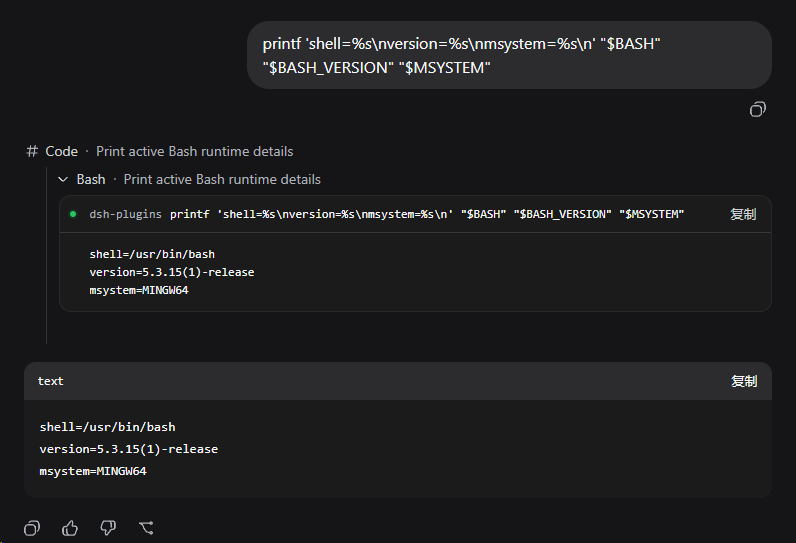

# dsh-plugin-git-bash

让 [DeepSeek Harness](https://github.com/deepseek-ai/deepseek-harness) 在 Windows 上默认使用 Git for Windows Bash，并保留 DSH 的 `read-only`、`workspace-write` 和 `danger-full-access` 权限语义。



## 使用方法

插件安装到 profile 后，`standard`、`code`、`cordis` 和 `minimal` preset 会使用 Git Bash 代替 PowerShell。前台命令、后台命令和 Web Agent preset 共用同一个 executor。

新建会话后可以运行以下命令确认 shell：

```sh
printf 'shell=%s\nversion=%s\nmsystem=%s\n' "$BASH" "$BASH_VERSION" "$MSYSTEM"
```

`MSYSTEM` 应为 `MINGW64` 或 `MINGW32`。

Web 界面中的 Bash 工具行可以展开查看 command、cwd、stdout/stderr 和 exit status。`run_code` 内的 nested Bash 调用使用同一套 terminal 详情；过长的 command 会自动换行，output 则保留终端横向滚动，以维持日志和表格的列对齐。

插件只作为 bundle layer 安装到目标 profile，不修改 DSH 安装目录。

## 安装或更新

从 npm 安装固定版本到 Web profile：

```sh
dsh plugin --profile web add dsh-plugin-git-bash@0.3.0
```

更新现有安装时使用同一条命令。安装完成后重启 `dsh web`，让 Host 和浏览器 client 同时加载新版本，然后新建会话。

安装最新版时可以省略版本号：

```sh
dsh plugin --profile web add dsh-plugin-git-bash
```

开发本地版本时传入 checkout 路径：

```powershell
dsh plugin --profile web add C:\path\to\dsh-git-bash
```

## 权限模式

### `read-only` 和 `workspace-write`

受限命令仍由 DSH Windows ACL sandbox 创建 `WRITE_RESTRICTED` token。插件在 sandbox 内先运行 native guard，再由 guard 启动 Git Bash：

```text
DSH ACL runner -> msys-token-guard.exe -> bash.exe -> child processes
```

- `read-only` 可以启动 Git Bash，但不能写 workspace。
- `workspace-write` 只能写 DSH 授权的 workspace 和 private temp。

### `danger-full-access`

该模式不经过 native guard，直接运行 Git Bash，与插件 0.1.x 的执行方式一致。

## 配置 Git Bash 路径

插件会自动探测 Program Files、用户安装目录和 Scoop 中的 Git Bash。Web GUI 中打开 `设置 -> 插件 -> 插件配置`，展开 `Git Bash` 卡片后可以直接输入 `bash.exe` 路径，或通过 `选择 Git 安装目录` 调用系统路径选择窗口。保存后，后续 Bash 命令会立即使用新路径；恢复默认值会回到 profile 配置或自动探测结果。

无 GUI 场景可以在启动 DSH 前设置 `DSH_GIT_BASH_PATH`：

```powershell
$env:DSH_GIT_BASH_PATH = 'D:\Apps\Git\bin\bash.exe'
dsh web
```

也可以直接在 profile 的 `cordis.patch.yml` 中为 provider 配置 `executable`：

```yaml
- id: git-bash-shell
  name: dsh-plugin-git-bash
  config:
    executable: D:\Apps\Git\bin\bash.exe
```

## 平台支持

运行时要求：

- Windows x64
- Node.js 24 或更高版本
- DSH `0.1.0-rc.7`
- Git for Windows x64

npm 包包含预编译的 `msys-token-guard.exe` 和 `msys-token-guard-hook.dll`，普通安装不需要 Visual Studio 或 CMake。当前 native guard 仅支持 `win32-x64`；其他架构在受限模式下返回 `SANDBOX_UNAVAILABLE`，不会降级到未隔离执行。

Microsoft Detours 4.0.1 源码按 MIT 许可存放在 `native/vendor/detours`，许可文本随 npm 包分发。Detours 的 DLL path 参数使用 Windows ANSI API，因此插件安装路径必须能由当前系统代码页无损表示，并且不能超过 `MAX_PATH`；不满足条件时 guard 会 fail closed。

## 开发

安装依赖并运行完整验证：

```sh
pnpm install
pnpm test
pnpm run pack:check
```

在 Windows 上重建 native artifact 还需要 Visual Studio C++ Build Tools 和 CMake 3.25 或更高版本。`pnpm test` 会以 C++20、静态 MSVC runtime、CFG、CET、ASLR 和 NX 构建 native guard，然后运行 Windows ACL permission matrix、fail-closed、Web client 和 package metadata 测试。

非 Windows 主机不会交叉编译 native guard，只会检查预编译 artifact 是否存在。

## License

MIT
